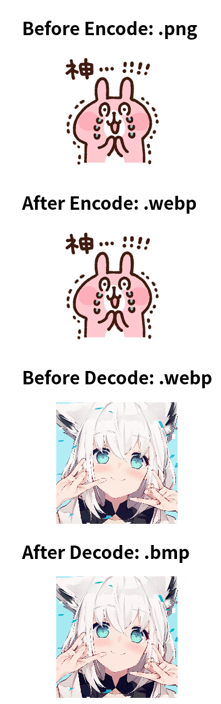

Emscripting libwebp to Wasm
===

- Encode part is mostly copy from https://developers.google.com/web/updates/2018/03/emscripting-a-c-library
- Decode part is mostly copy from https://medium.com/@kennethrohde/on-the-fly-webp-decoding-using-wasm-and-a-service-worker-33e519d8c21e

screenshot
---

